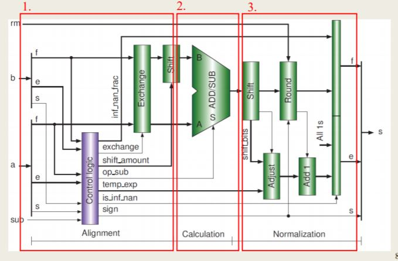
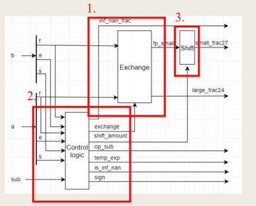
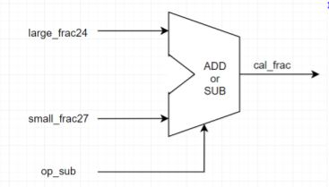
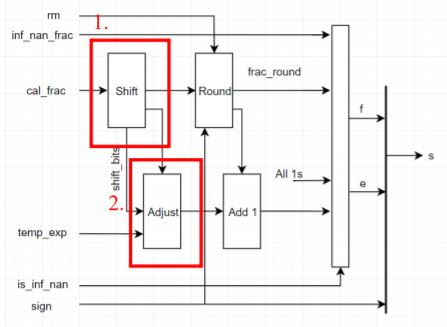

# IEEE_FloatingPoint_FPAdder
Floating Point Add/Subtract for ieee754 and ieee_16 bits

## Run
<pre><code>vvp testbench</code></pre>

## 過程
將程式碼分成三個主要部分:

+ alignment：開始運算之前，將兩數的次方及尾數對齊
+ calculation：以正負號決定執行加法或減法
+ normalization：運算後的結果要轉回IEEE 754表示法，而在運算的過程中可能因為精確度造成bit過多，這時還需要將這些bit做捨入

### 1. Alignment
+ Exchange：判斷a或b大，分別儲存
+ Control logic：控制硬體各個元件
+ Shift：將小的數值位移

### 2. Calculation
將要運算的兩數以及運算符號傳入，加上grs以及考慮溢位的狀況，將兩者bit對齊，再做運算

### 3. Normalization
+ Shift：決定要向左或右移動幾位
+ Adjust：依照位移bit調整指數與有效位
+ Round
根據 [wiki_ieee754](https://en.wikipedia.org/wiki/IEEE_754#Rounding_rules) 所提供的方式進行捨入，分別是
1. 捨入到最近：將結果修約為最接近且可以表示的值，但是當存在兩個數一樣接近的時候，則取其中的偶數（Ties To Even）
2. 向負無窮捨入
3. 向正無窮捨入
4. 朝0捨入
+ Add 1：將調整後與捨入後結果運算

